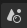
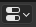
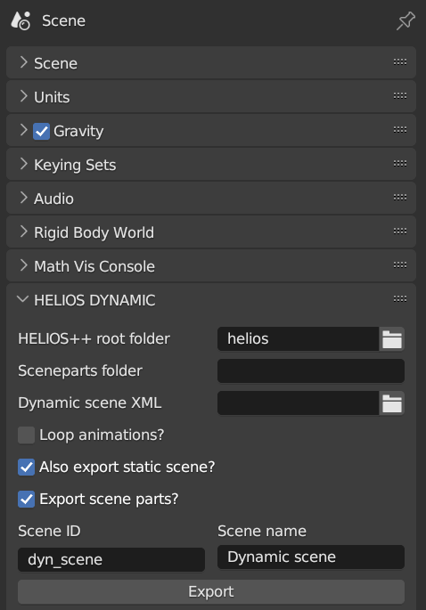
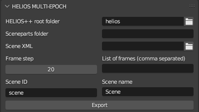
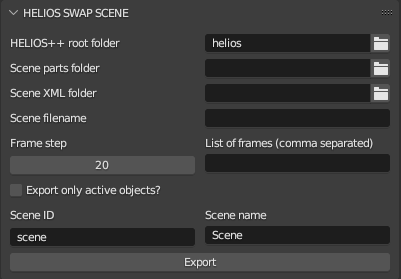

# Dynamic Scenes: Blender to HELIOS++ (dyn_b2h)

Blender Add-on for exporting dynamic/animated scenes from Blender to HELIOS++

<!-- TABLE OF CONTENTS -->

  
Table of Contents

  <ol>
    <li>
      <a href="#about-the-project">About The Project</a>
    </li>
    <li>
      <a href="#getting-started">Getting Started</a>
      <ul>
        <li><a href="#prerequisites">Prerequisites</a></li>
        <li><a href="#installation">Installation</a></li>
      </ul>
    </li>
    <li><a href="#usage">Usage</a></li>
    <li><a href="#license">License</a></li>
    <li><a href="#contact">Contact</a></li>
  </ol>

<!-- ABOUT THE PROJECT -->
## About The Project

This repo contains two Blender add-ons which allow exporting an animated Blendr scene to a HELIOS++ scene. It involves exporting the scene parts (OBJ files) and writing a HELIOS++ scene file.

1. **dyn_b2h**:
    - This add-on is for animated scenes with rigid motions. The HELIOS++ scene that is written contains sequences of rigid motions for the dynamic objects. As of now, it supports simple motions composed of translations and rotations.
2. **multi_epoch_b2h**:
    - This add-on is for any animated scenes, those with rigid motions but also those created with deformation or wind modifiers. It allows exporting (static) snapshots of a scene to OBJ files and HELIOS++ XMLs at different timestamps (frames). The output is a separate scene for each specified frame.
3. **swap_b2h**:
    - This add-on is for animated scenes (as above: rigid motions, deformation, wind, etc.). It exports the statis scene parts once and the dynamic scene parts for each specified frame. A single HELIOS++ XML file is then written, where the dynamic sceneparts are "swapped" for a new OBJ file each frame using the H++ swap feature. If a survey is executed using this scene, as many simulations are conducted as swaps found in the scene XML file.

<!-- GETTING STARTED -->
## Getting Started

The Blender add-ons are contained in the folders `dyn_b2h`, `multi_epoch_b2h`, and `swap_b2h`.

### Prerequisites

- [Blender](https://www.blender.org/) (version >= 3.4.0 and < 4.0.0)
- [HELIOS++](https://github.com/3dgeo-heidelberg/helios)
- Clone or download this repository

### Installation

You can install just one of the add-ons or all of them. The add-ons contain several modules. Prior to installing them, zip the folders *dyn_b2h* and/or *multi_epoch_b2h*. In Blender, go to Edit -> Preferences... -> Add-ons. Here, click on "Install..." and navigate to the zip folder *dyn_b2h.zip*/*multi_epoch_b2h.zip*/*swap_b2h.zip* using the file browser. The installed add-on now appears in the menu. Activate the add-on by clicking on the checkmark. If you now go to the "Scene Properties" 
tab in the "Properties" Window , you should see a new menu ("HELIOS DYNAMIC" / "HELIOS MULTI-EPOCH" / "HELIOS SWAP SCENE").

<!-- USAGE EXAMPLES -->
## Usage

### dyn_b2h

Create any scene in Blender, which you want to run a simulation on. The scene can include animations, created by changing the object location or rotation and then inserting keyframes. Before exporting a dynamic scene, make sure to "bake" the action. Select the animated object, and then (in Object mode), select Object -> Animation -> Bake Action... Select the desired start frame, end frame and frame step and click OK. 

Now you are ready for exporting the scene. Go to the HELIOS DYNAMIC menu in the "Scene Properties", which looks like this:

Select your HELIOS++ root folder and the name of your sceneparts subfolder. This name will automatically be appended to `<your-helios-root_dir>/data/sceneparts`. The add-on will export the meshes in your Blender scene to this folder in OBJ format. Furthermore, browse for the XML file to which the dynamic scene shall be written.

In the three checkboxes, you can decide
- whether to loop the animations or stop the rigid motions after the animations have completed.
- whether to also export a static version of the scene (i.e. without animations: dynamic objects will have the position and orientation that they have at frame 0).
- whether to export scene parts. This may be unchecked if you re-export your scene multiple times after changing the animation, but not the objects itself, so the files do not have to be written each time (which may take quite a while).

Lastly, define an ID and name for your scene, which will be written into the scene XML file.

When you are ready, hit "Export" and wait for the export to complete.

You can now use the generated scene XML to run a HELIOS++ simulation. Simply create a [survey XML](https://github.com/3dgeo-heidelberg/helios/wiki/Survey) file which performs a simulated laser scanning survey over the scene. Execute the survey with HELIOS++.

### multi_epoch_b2h (legacy - use `swap_b2h` instead!)

Create any scene in Blender, which you want to run a simulation on. The scene can include animations, inserted using keyframes or using modifiers like wind or deformation. Before exporting a dynamic scene, make sure to select a suitable end frame in your Animation Timeline which covers your animation well. If not providing a list of specific frames, the exported frames will be determined based on the frame step you provide and the end frame configured in your Animation Timeline. Objects without animations are just exported to file once and re-used in the separate HELIOS++ scenes. Objects with animations are re-exported at each frame. 

Now you are ready for exporting the scene. Go to the HELIOS MULTI-EPOCH menu in the "Scene Properties", which looks like this:

Select your HELIOS++ root folder and the name of your sceneparts subfolder. This name will automatically be appended to `<your-helios-root_dir>/data/sceneparts`. The add-on will export the meshes in your Blender scene to this folder in OBJ format. Furthermore, browse for the XML file to which the dynamic scene shall be written. The current frame number will be appended to this XML as suffix, i.e., *data/scenes/my_scene/scene_001.xml*, *data/scenes/my_scene/scene_021.xml*, *data/scenes/my_scene/scene_041.xml*, etc.

Select a frame step that defines the interval at which frames are exported, or specify a list of frames. The list of frames should be a comma-separated string, e.g., `9,15,34,90,92,105`. If a list of frames is provided, the frame step will be ignored. 

Lastly, define an ID and name for your scene, which will be written into the scene XML file.

When you are ready, click "Export" and wait for the export to complete.

You can now use the generated scene XMLs to run HELIOS++ simulations. Create a separate [survey XML](https://github.com/3dgeo-heidelberg/helios/wiki/Survey) for each epoch to create a time series of simulated laser scanning survey over the dynamic scenes. Execute the surveys with HELIOS++.

### swap_b2h

Create any scene in Blender, which you want to run a simulation on. The scene can include animations, inserted using keyframes or using modifiers like wind or deformation. Before exporting a dynamic scene, make sure to select a suitable end frame in your Animation Timeline which covers your animation well. If not providing a list of specific frames, the exported frames will be determined based on the frame step you provide and the end frame configured in your Animation Timeline. Objects without animations are just exported to file once, objects with animations are re-exported at each frame. 

Now you are ready for exporting the scene. Fo to the HELIOS SWAP SCENE menu in the "Scene Properties", which looks like this:

Select your HELIOS++ root folder, the sceneparts folder and the scene XML folder using the file browser. Also specify the scene filename.

If the scene filename is empty, then the name of the respective collection in your view layer will be used and a separate scene will be created for each view layer you have. If a scene filename is provided, it is expected that you only have a single collection. If you have several, then the previous ones will be overwritten.

Select a frame step that defines the interval at which frames are exported, or specify a list of frames. The list of frames should be a comma-separated string, e.g., `9,15,34,90,92,105`. If a list of frames is provided, the frame step will be ignored.

Lastly, define an ID and name for your scene, which will be written into the scene XML file.

When you are ready, click "Export" and wait for the export to complete.

You can now use the generated scene XML to run HELIOS++ simulations. Create a [survey XML](https://github.com/3dgeo-heidelberg/helios/wiki/Survey), which uses the generated scene. As the `swap` feature is used, a single survey file will result in as many simulations, as frames you provided (i.e., as swaps found in the scene XML). Execute the surveys with HELIOS++.

<!-- LICENSE -->
## License

This project is licensed under the GNU GENERAL PUBLIC LICENSE.
See [LICENSE]((https://github.com/3dgeo-heidelberg/dyn_b2h/blob/main/LICENSE)).

<!-- CONTACT -->
## Contact

Hannah Weiser - h.weiser@uni-heidelberg.de

- Project Link: [https://github.com/3dgeo-heidelberg/dyn_b2h/](https://github.com/3dgeo-heidelberg/dyn_b2h/)
- 3DGeo Website: [www.uni-heidelberg.de/3dgeo](https://www.geog.uni-heidelberg.de/3dgeo/index.html)
